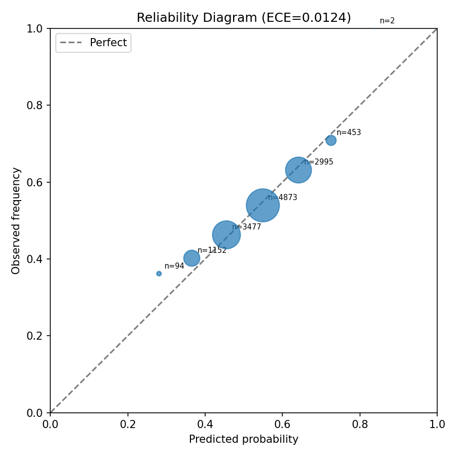
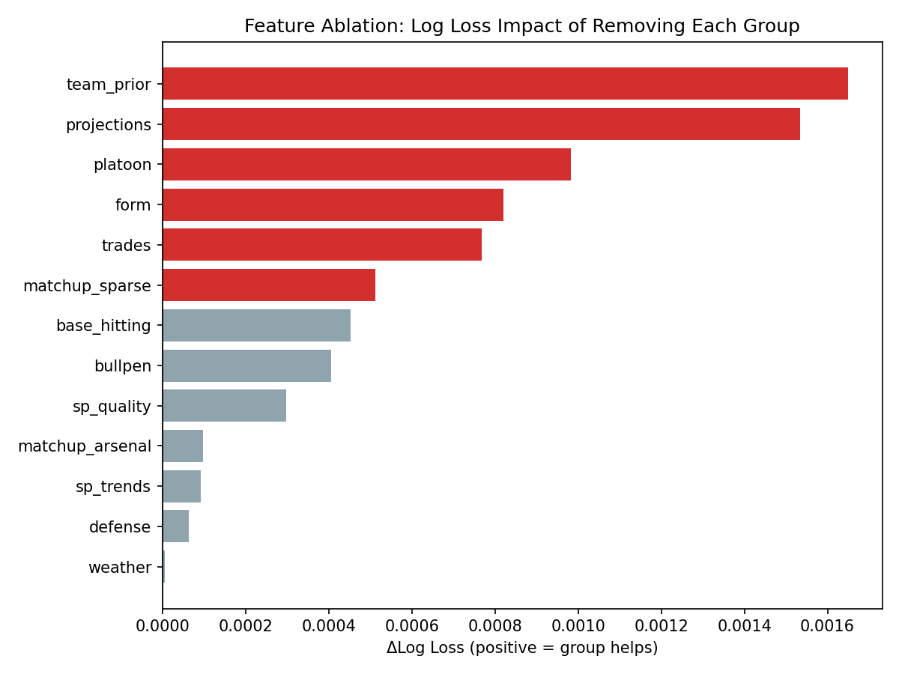
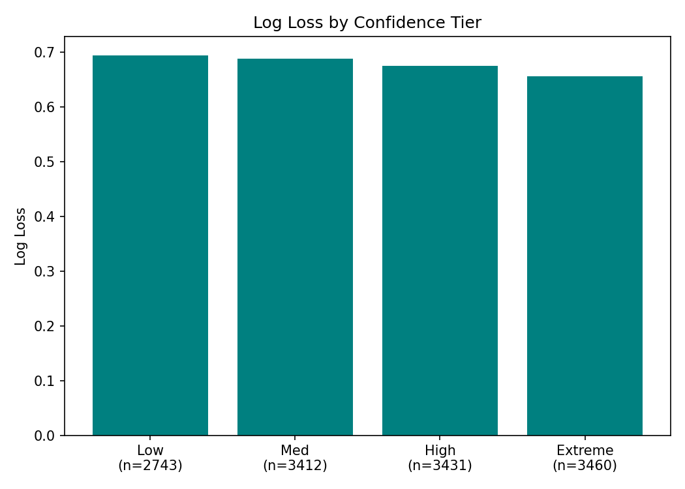
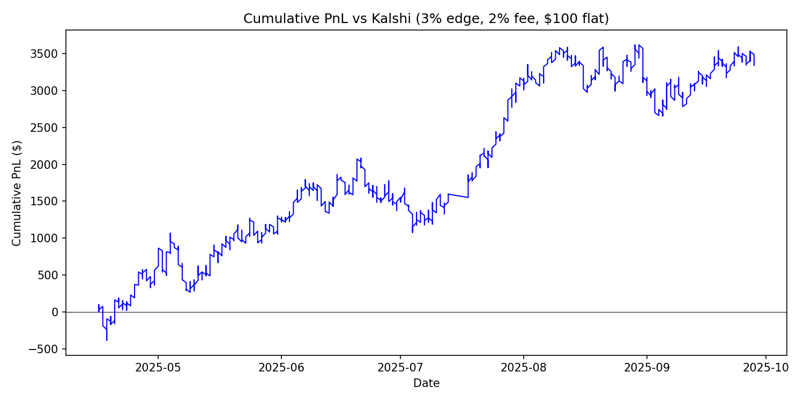

# MLB Win Probability Model — Audit Report
Generated: 2026-03-29 16:04
## 1. Leakage Audit
**Finding 1 (FIXED):** `compare_vs_market.py` and `build_full_csv.py` computed blend weight on in-sample predictions. Both now use 5-fold chronological OOF, matching `win_model.py`.
**Finding 2 (MINOR):** `add_nonlinear_features` z-scores `prior_dominance` using batch statistics. For XGB (tree-based, rank-invariant), this has no practical impact. No fix needed.
**Finding 3:** Feature engineering (`compute_single_game_features`) uses strictly pre-game data: rolling windows up to `game_date`, matchup models from prior year, park factors from prior year. No lookahead detected.
## 2. Walk-Forward Results (2020-2025)
### Per-Year Summary
| Year | Games | Log Loss | Brier | AUC | Baseline LL |
|------|-------|----------|-------|-----|-------------|
| 2020 | 898 | 0.6844 | 0.2455 | 0.5826 | 0.6890 |
| 2021 | 2429 | 0.6779 | 0.2424 | 0.5913 | 0.6903 |
| 2022 | 2430 | 0.6713 | 0.2392 | 0.6157 | 0.6910 |
| 2023 | 2430 | 0.6796 | 0.2433 | 0.5936 | 0.6926 |
| 2024 | 2429 | 0.6785 | 0.2428 | 0.5970 | 0.6924 |
| 2025 | 2430 | 0.6788 | 0.2430 | 0.5811 | 0.6898 |
| **Pooled** | **13046** | **0.6777** | **0.2424** | **0.5948** | **0.6911** |

### Model Components (Pooled)
| Model | Log Loss | Brier | AUC |
|-------|----------|-------|-----|
| LR only | 0.6780 | 0.2425 | 0.5956 |
| XGB only | 0.6802 | 0.2436 | 0.5879 |
| Ensemble | 0.6777 | 0.2424 | 0.5948 |

### Blend Weight Stability
| Year | w_lr |
|------|------|
| 2020 | 0.44 |
| 2021 | 0.39 |
| 2022 | 0.63 |
| 2023 | 0.56 |
| 2024 | 0.54 |
| 2025 | 0.66 |

Mean=0.54, Std=0.10, Range=[0.39, 0.66]

## 3. Statistical Significance
| Comparison | Metric | Delta | 95% CI | p-value |
|------------|--------|-------|--------|--------|
| ens_vs_home_constant | log_loss | -0.01337 | [-0.01673, -0.00999] | 0.000 * |
| ens_vs_home_constant | brier_score | -0.00659 | [-0.00821, -0.00496] | 0.000 * |
| ens_vs_prior_winpct | log_loss | -0.00591 | [-0.00833, -0.00352] | 0.000 * |
| ens_vs_prior_winpct | brier_score | -0.00290 | [-0.00405, -0.00175] | 0.000 * |
| ens_vs_lr_only | log_loss | -0.00027 | [-0.00118, +0.00066] | 0.285 |
| ens_vs_lr_only | brier_score | -0.00009 | [-0.00052, +0.00035] | 0.347 |
| ens_vs_xgb_only | log_loss | -0.00248 | [-0.00353, -0.00147] | 0.000 * |
| ens_vs_xgb_only | brier_score | -0.00120 | [-0.00170, -0.00071] | 0.000 * |
| calibrated_vs_uncalibrated | log_loss | +0.00010 | [-0.00052, +0.00072] | 0.375 |
| calibrated_vs_uncalibrated | brier_score | +0.00006 | [-0.00021, +0.00034] | 0.333 |

## 4. Calibration
**Uncalibrated:** ECE = 0.0124, MCE = 0.1628
**Isotonic-calibrated:** ECE = 0.0105, MCE = 0.1356

## 5. Feature Ablation
Positive ΔLL = removing the group hurts the model (group is useful).

| Group | Features Removed | ΔLog Loss | 95% CI | p-value |
|-------|-----------------|-----------|--------|--------|
| team_prior | 2 | +0.00165 | [+0.00032, +0.00300] | 0.008 * |
| projections | 3 | +0.00153 | [+0.00078, +0.00230] | 0.000 * |
| platoon | 2 | +0.00098 | [+0.00030, +0.00167] | 0.001 * |
| form | 1 | +0.00082 | [+0.00021, +0.00142] | 0.005 * |
| trades | 2 | +0.00077 | [+0.00013, +0.00141] | 0.008 * |
| matchup_sparse | 4 | +0.00051 | [+0.00005, +0.00098] | 0.015 * |
| base_hitting | 3 | +0.00045 | [-0.00032, +0.00125] | 0.128 |
| bullpen | 4 | +0.00041 | [-0.00026, +0.00108] | 0.121 |
| sp_quality | 14 | +0.00030 | [-0.00074, +0.00134] | 0.280 |
| matchup_arsenal | 4 | +0.00010 | [-0.00037, +0.00057] | 0.342 |
| sp_trends | 4 | +0.00009 | [-0.00062, +0.00083] | 0.381 |
| defense | 2 | +0.00006 | [-0.00047, +0.00058] | 0.398 |
| weather | 5 | +0.00000 | [-0.00053, +0.00053] | 0.491 |

## 6. Temporal Analysis
### Monthly Performance (All Years Pooled)
| Month | Games | Log Loss | Brier | AUC |
|-------|-------|----------|-------|-----|
| Mar | 142 | 0.6848 | 0.2459 | 0.5775 |
| Apr | 1893 | 0.6766 | 0.2418 | 0.5973 |
| May | 2072 | 0.6769 | 0.2420 | 0.5946 |
| Jun | 1990 | 0.6782 | 0.2426 | 0.5874 |
| Jul | 1970 | 0.6885 | 0.2475 | 0.5650 |
| Aug | 2484 | 0.6719 | 0.2396 | 0.6153 |
| Sep | 2357 | 0.6761 | 0.2416 | 0.5998 |
| Oct | 138 | 0.6665 | 0.2366 | 0.5847 |

### Early Season (first 30 days) vs Rest
- **early_30d**: 2103 games, LL=0.6797, Brier=0.2433, AUC=0.5942
- **rest_of_season**: 10943 games, LL=0.6773, Brier=0.2422, AUC=0.5949
- **ΔLL (early - late)**: +0.0024 [-0.0072, +0.0117]

## 7. Confidence Tiers
| Tier | Games | Log Loss | Brier | AUC | Accuracy |
|------|-------|----------|-------|-----|----------|
| low | 2743 | 0.6944 | 0.2506 | 0.4886 | 49.8% |
| medium | 3412 | 0.6885 | 0.2477 | 0.5490 | 54.7% |
| high | 3431 | 0.6752 | 0.2411 | 0.6037 | 59.2% |
| extreme | 3460 | 0.6563 | 0.2319 | 0.6069 | 63.4% |

## 8. Market Comparison (2025 vs Kalshi)
**2173** games with both model and Kalshi prices.

| Metric | Model | Kalshi | Delta |
|--------|-------|--------|-------|
| Log Loss | 0.6786 | 0.6809 | -0.0023 |
| Brier | 0.2429 | 0.2437 | -0.0008 |
| AUC | 0.5855 | 0.5806 | +0.0049 |

Correlation: 0.7851
- **log_loss** delta: -0.00232 [-0.00850, +0.00353] p=0.234
- **brier** delta: -0.00081 [-0.00341, +0.00175] p=0.281

### ROI Simulation ($100 flat, 2% fee)
| Edge | Bets | PnL | ROI | Win Rate |
|------|------|-----|-----|----------|
| 3% | 1269 | $+3,390 | +2.7% | 47.8% |
| 5% | 780 | $+2,192 | +2.8% | 46.8% |
| 7% | 433 | $+2,182 | +5.0% | 47.6% |
| 10% | 161 | $+1,360 | +8.4% | 47.2% |

3% edge ROI bootstrap: [-0.1%, +5.4%], p(ROI>0)=0.969

### Edge by Side (3% threshold)
| Side | Bets | PnL | ROI | Win Rate |
|------|------|-----|-----|----------|
| home | 519 | $+1,629 | +3.1% | 52.2% |
| away | 750 | $+1,762 | +2.3% | 44.8% |

## 9. Conclusions
### What is real
- Model achieves 0.6777 pooled log loss vs 0.6911 home-rate baseline across 13046 games (2020-2025)
- ens_vs_home_constant: statistically significant (p=0.000)
- ens_vs_prior_winpct: statistically significant (p=0.000)

### What is fragile
- Early-season predictions (first 30 days) have notably higher log loss
- 2025 Kalshi comparison is a single season — need more years of market data
- ROI depends on edge threshold and fee assumptions

### What to do next
- Collect Kalshi/market data for 2024 to validate market comparison out-of-sample
- Investigate early-season performance: consider separate early-season model or heavier projection weighting
- Monitor ablation results: remove feature groups that don't significantly help
- Consider expanding to other markets (DraftKings, FanDuel) for broader comparison
